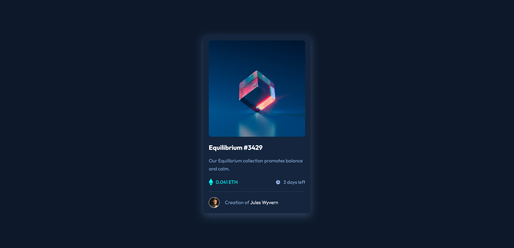

# Frontend Mentor - NFT preview card component solution

This is a solution to the [NFT preview card component challenge on Frontend Mentor](https://www.frontendmentor.io/challenges/nft-preview-card-component-SbdUL_w0U). Frontend Mentor challenges help you improve your coding skills by building realistic projects. 

## Table of contents

- [Overview](#overview)
  - [The challenge](#the-challenge)
  - [Screenshot](#screenshot)
  - [Links](#links)
- [My process](#my-process)
  - [Built with](#built-with)
  - [What I learned](#what-i-learned)
  - [Useful resources](#useful-resources)
- [Author](#author)
- [Acknowledgments](#acknowledgments)

## Overview

### The challenge

Users should be able to:

- View the optimal layout depending on their device's screen size
- See hover states for interactive elements

### Screenshot

### Links

- Solution URL: [Github respository files](https://your-solution-url.com)
- Live Site URL: [Interactive rating component solution](https://your-live-site-url.com)

## My process

### Built with

- Semantic HTML5 markup
- CSS custom properties
- Flexbox

### What I learned

Utilising the background properties such as background-position, background-size, and background-repeats were new. This allowed me to create size and position the background image for the overlay effect. Creating the overlay effect was interesting.

### Useful resources

- [Create a hover overlay effect](https://sirv.com/help/articles/hover-change-image/) - I used this format to create the hover overlay effect. Additionally, I made use of the developer tools to make a bit more sense of the HTML and CSS structures.

## Author

- Frontend Mentor - [@EJMK18](https://www.frontendmentor.io/profile/EJMK18)
- Twitter - [@EJMK18](https://twitter.com/EJMK18)

## Acknowledgments

Website used for the overlay effect feature: [Sirv](https://sirv.com/)